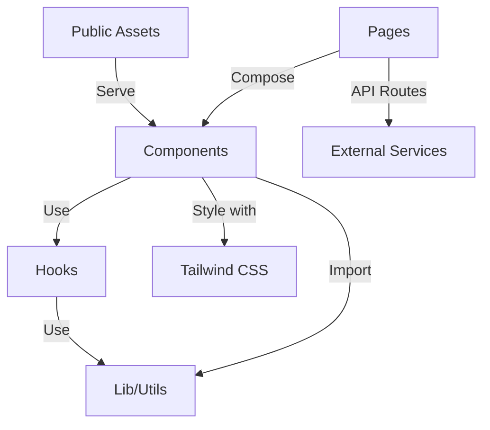

# Architecture Overview

This document provides a high-level overview of the portfolio application's architecture, design decisions, and code organization.

## Table of Contents

- [Project Structure](#project-structure)
- [Architecture Diagram](#architecture-diagram)
- [Design Decisions](#design-decisions)
- [State Management](#state-management)
- [Data Flow](#data-flow)
- [Performance Considerations](#performance-considerations)
- [Testing Strategy](#testing-strategy)
- [Security Considerations](#security-considerations)

## Project Structure

```
heyitspriyanshu/
├── app/                    # App Router pages and layouts
│   ├── layout.tsx         # Root layout
│   ├── page.tsx           # Home page
│   └── projects/          # Projects page and sub-pages
│
├── components/            # Reusable UI components
│   ├── atoms/             # Atomic design atoms
│   ├── molecules/         # Molecular components
│   ├── organisms/         # Complex UI components
│   ├── sections/          # Page sections
│   ├── templates/         # Layout templates
│   └── ui/                # shadcn/ui components
│
├── hooks/                # Custom React hooks
│   ├── use-media-query.ts
│   └── use-scroll-spy.ts
│
├── lib/                  # Utility functions and shared code
│   ├── utils.ts           # General utilities
│   ├── animation.ts       # Animation variants
│   └── constants/         # Application constants
│
├── public/               # Static assets
│   ├── images/            # Image assets
│   └── docs/              # Document downloads
│
├── styles/               # Global styles
│   ├── globals.css        # Global styles
│   └── theme/             # Theme configurations
│
├── types/                # TypeScript type definitions
│   └── index.ts
│
├── .env.local           # Environment variables
├── next.config.mjs        # Next.js configuration
├── tailwind.config.ts     # Tailwind CSS configuration
└── tsconfig.json         # TypeScript configuration
```

## Architecture Diagram



## Design Decisions

### 1. Component Architecture

- **Atomic Design**: Components are organized following Atomic Design principles
- **Composition**: Components are composed together to build complex UIs
- **Reusability**: Common UI patterns are abstracted into reusable components
- **Separation of Concerns**: UI, logic, and styles are co-located when possible

### 2. Styling

- **Tailwind CSS**: Utility-first CSS framework for styling
- **CSS Variables**: For theming and design tokens
- **CSS Modules**: For component-scoped styles when needed
- **Responsive Design**: Mobile-first approach with responsive utilities

### 3. State Management

- **React Hooks**: For local component state
- **Context API**: For global application state
- **URL State**: For shareable and bookmarkable states
- **Server State**: For data fetching and caching

### 4. Data Fetching

- **Static Generation (SSG)**: For pages with content that doesn't change often
- **Server-Side Rendering (SSR)**: For dynamic content
- **Incremental Static Regeneration (ISR)**: For pages that can be revalidated
- **Client-Side Fetching**: For highly dynamic data

## State Management

### Local State

- **useState**: For simple component state
- **useReducer**: For complex state logic
- **useImmer**: For nested state updates

### Global State

- **Context API**: For application-wide state
- **React Query**: For server state management
- **URL State**: For shareable UI states

### Data Fetching

- **Static Data**: Pre-rendered at build time
- **Dynamic Data**: Fetched client-side or server-side
- **Caching**: Implemented with React Query

## Data Flow

1. **Static Generation**
   - Data fetched at build time
   - Cached and served as static HTML

2. **Server-Side Rendering**
   - Data fetched on each request
   - Rendered on the server

3. **Client-Side Data Fetching**
   - Data fetched after component mounts
   - Handles loading and error states

## Performance Considerations

### Code Splitting

- **Dynamic Imports**: For code splitting
- **Lazy Loading**: For below-the-fold content
- **Route-based Splitting**: Automatically handled by Next.js

### Image Optimization

- **next/image**: For automatic image optimization
- **Responsive Images**: Using `sizes` and `srcSet`
- **Lazy Loading**: For offscreen images

### Bundle Optimization

- **Tree Shaking**: Remove unused code
- **Code Splitting**: Split code by route
- **Deduplication**: Avoid duplicate dependencies

## Testing Strategy

### Unit Testing

- **Jest**: Test runner
- **React Testing Library**: For component testing
- **@testing-library/user-event**: For user interactions

### Integration Testing

- **Cypress**: For end-to-end testing
- **Mock Service Worker (MSW)**: For API mocking

### Visual Regression Testing

- **Storybook**: For component development and testing
- **Chromatic**: For visual regression testing

## Security Considerations

### Data Sanitization

- **DOMPurify**: For sanitizing HTML content
- **Input Validation**: Validate all user inputs

### Authentication

- **NextAuth.js**: For authentication
- **JWT**: For session management

### API Security

- **CORS**: Configured on the API routes
- **Rate Limiting**: Implement rate limiting
- **CSRF Protection**: Built-in with Next.js

## Performance Monitoring

- **Web Vitals**: Monitor Core Web Vitals
- **Sentry**: For error tracking
- **Custom Metrics**: For business-specific metrics

## Error Handling

- **Error Boundaries**: Catch JavaScript errors
- **Global Error Handler**: For uncaught exceptions
- **User-Friendly Messages**: Show helpful error messages

## Accessibility (a11y)

- **Semantic HTML**: Use proper HTML elements
- **ARIA Attributes**: For enhanced accessibility
- **Keyboard Navigation**: Ensure all interactive elements are keyboard accessible
- **Screen Reader Testing**: Test with screen readers
- **Color Contrast**: Ensure sufficient contrast ratios

## Internationalization (i18n)

- **next-intl**: For internationalization
- **Language Detection**: Auto-detect user's language
- **RTL Support**: For right-to-left languages

## Analytics

- **Google Analytics**: For traffic analysis
- **Custom Events**: Track user interactions
- **Privacy-First**: Comply with GDPR and CCPA

## Continuous Integration/Deployment (CI/CD)

- **GitHub Actions**: For CI/CD pipelines
- **Automated Testing**: Run tests on push/pull request
- **Preview Deployments**: For pull requests
- **Automated Versioning**: Semantic versioning

## Documentation

- **Storybook**: For component documentation
- **JSDoc**: For code documentation
- **README.md**: Project overview and setup
- **ARCHITECTURE.md**: This document

## Future Improvements

1. **Performance**
   - Implement code splitting for larger components
   - Optimize bundle size
   - Add service worker for offline support

2. **Testing**
   - Increase test coverage
   - Add visual regression tests
   - Implement E2E tests

3. **Features**
   - Add dark/light theme toggle
   - Implement i18n
   - Add search functionality

4. **Developer Experience**
   - Add more detailed documentation
   - Improve error messages
   - Add more TypeScript types

## Conclusion

This architecture provides a solid foundation for building a maintainable, performant, and scalable portfolio application. By following these principles and best practices, we can ensure the application remains easy to develop, test, and maintain as it grows.
